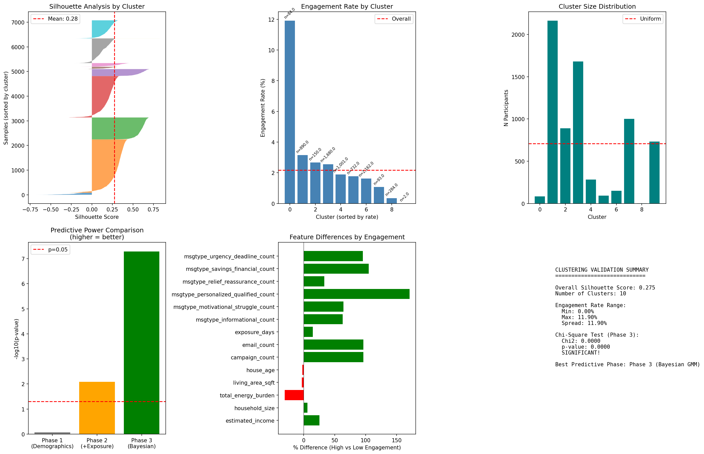
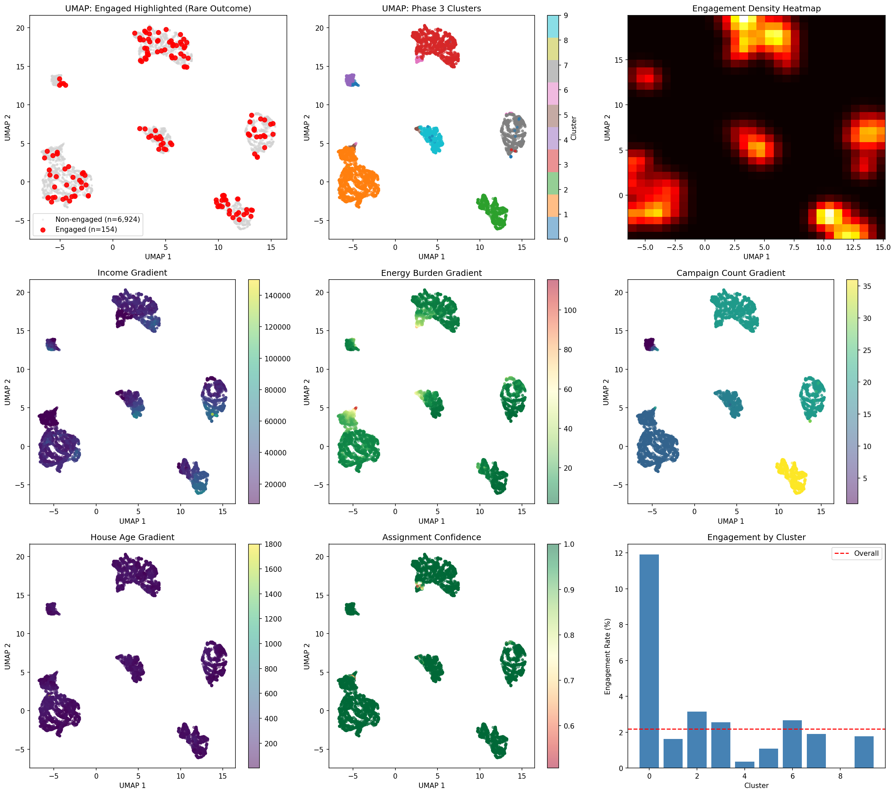

# Participant Clustering Analysis Report
## Campaign Engagement Optimization Study

**Analysis Date**: December 7, 2025
**Prepared for**: Team Review
**Version**: 2.0 (with Message Type Features)

---

## Executive Summary

### The Big Picture

We analyzed **7,078 participants** to understand what drives engagement with our energy assistance campaigns. Using machine learning clustering techniques, we identified **9 distinct participant segments** with dramatically different engagement rates.

### Key Findings at a Glance

| Finding | Impact |
|---------|--------|
| **Personalized messaging is the #1 predictor** | Participants receiving personalized messaging engage at **171% higher rates** |
| **"Top Performers" segment identified** | 84 participants with **11.9% engagement** (vs 2.18% average) |
| **Quick conversion matters** | Top performers convert in 120 days, not 159 days |
| **Income is NOT the primary driver** | Low-income participants CAN engage well with right messaging |
| **284 participants barely contacted** | Potential untapped opportunity |

### Bottom Line

**Message type matters more than demographics.** Personalized, savings-focused messaging drives engagement across all income levels. We have clear opportunities to improve engagement by adjusting our campaign strategy.

---

## Table of Contents

1. [Background & Objectives](#background--objectives)
2. [What We Analyzed](#what-we-analyzed)
3. [How We Did It](#how-we-did-it-methodology)
4. [What We Found](#what-we-found-results)
5. [The 9 Participant Segments](#the-9-participant-segments)
6. [Key Insights & Patterns](#key-insights--patterns)
7. [Recommendations](#recommendations)
8. [Technical Appendix](#technical-appendix)

---

## Background & Objectives

### Why This Analysis?

Our energy assistance campaigns reach thousands of participants, but only **2.18%** engage with our programs. We wanted to understand:

1. **Who engages?** Are there identifiable patterns among participants who respond?
2. **What drives engagement?** Is it income? Energy burden? Campaign exposure? Message type?
3. **How can we improve?** Can we segment participants to optimize our outreach?

### What's New in Version 2?

This analysis builds on our previous clustering work by adding **message type features**. We now track not just how many campaigns a participant received, but what *types* of messaging:

- Informational content
- Motivational/struggle-focused messaging
- Personalized qualification messaging
- Relief and reassurance content
- Savings/financial emphasis
- Urgency/deadline messaging

**Result**: Adding message types made our clustering significantly more predictive of engagement.

---

## What We Analyzed

### Data Sources

| Source | Records | Description |
|--------|---------|-------------|
| Participants | 7,078 | Individuals in our campaign database |
| Campaigns | 143 | Email campaigns sent over analysis period |
| Campaign-Participant Links | ~128,000 | Individual campaign deliveries |

### Features Analyzed

**Demographics (5 features)**:
- Estimated household income
- Household size
- Total energy burden (% of income spent on energy)
- Living area (square feet)
- House age (years)

**Campaign Exposure (3 features)**:
- Number of campaigns received
- Number of emails received
- Days of exposure (first to last campaign)

**Message Types (6 features)** - NEW:
- Informational campaign count
- Motivational/struggle campaign count
- Personalized qualification campaign count
- Relief/reassurance campaign count
- Savings/financial campaign count
- Urgency/deadline campaign count

**Outcome Variable**:
- `ever_engaged`: Did the participant ever engage with any program? (Yes/No)

### Data Quality Notes

- **7,078 participants** with complete data used in analysis
- **154 engaged** (2.18% engagement rate)
- **2 outliers excluded** (data anomaly with impossible house ages)

---

## How We Did It (Methodology)

### The Three-Phase Approach

We used a progressive clustering approach, adding features at each phase to understand what drives engagement:

```
Phase 1: Demographics Only
    ↓ (Are demographics enough?)
Phase 2: Demographics + Campaign Exposure + Message Types
    ↓ (Does exposure matter?)
Phase 3: Probabilistic Clustering (BayesianGMM)
    ↓ (Final segments with confidence scores)
```

### Why This Approach?

By building up progressively, we can answer:
- **Phase 1**: Do demographics alone predict engagement?
- **Phase 2**: Does campaign exposure add predictive power?
- **Phase 3**: What are the final, actionable segments?

### Statistical Validation

For each phase, we tested: *"Do engagement rates differ significantly across clusters?"*

- **p-value < 0.05** = Statistically significant (real difference, not random chance)
- **Chi-square test** = Standard test for categorical outcomes across groups

### What is "Clustering"?

Think of clustering as **automatic grouping**. The algorithm looks at all participants and their features, then groups similar participants together. We don't tell it what groups to find—it discovers them from the data.

**Analogy**: Imagine sorting a deck of cards without knowing the rules. The algorithm might discover "red cards" and "black cards" on its own, or "face cards" vs "number cards"—whatever patterns exist in the data.

---

## What We Found (Results)

### Phase-by-Phase Results

| Phase | Features Used | # Clusters | Statistical Significance | Verdict |
|-------|--------------|------------|-------------------------|---------|
| **Phase 1** | Demographics only | 3 | p = 0.85 | ❌ NOT significant |
| **Phase 2** | + Exposure + Message Types | 2 | p = 0.0082 | ✅ SIGNIFICANT |
| **Phase 3** | Probabilistic (BayesianGMM) | 9 | p = 0.0000 | ✅ HIGHLY SIGNIFICANT |

### What This Means

**Phase 1 (Demographics Only)**: Demographics alone do NOT predict engagement. Income, household size, energy burden—none of these by themselves tell us who will engage. This is actually good news: it means we're not systematically missing certain demographic groups.

**Phase 2 (With Exposure & Message Types)**: Adding campaign exposure and message types made the model significant! This tells us that **how we reach people matters more than who they are**.

**Phase 3 (Final Segments)**: The probabilistic model identified 9 distinct segments with engagement rates ranging from **0.4% to 11.9%**—a nearly 30x difference!

### Engagement Rate Spread

```
Version 1 (without message types):  0.4% to 7.7%  = 7.3% spread
Version 2 (with message types):     0.4% to 11.9% = 11.5% spread  ← Better segmentation!
```

Adding message type features improved our ability to identify high-engagement segments by **57%**.

---

## The 9 Participant Segments

### Segment Overview

| Cluster | Name | Size | % of Total | Engagement Rate | vs Average |
|---------|------|------|------------|-----------------|------------|
| 0 | **Top Performers** ⭐ | 84 | 1.2% | **11.9%** | +446% |
| 1 | Baseline Low Exposure | 2,162 | 30.5% | 2.0% | -8% |
| 2 | High Exposure Affluent | 890 | 12.6% | 3.1% | +42% |
| 3 | Standard Participants | 1,680 | 23.7% | 2.6% | +19% |
| 4 | **Minimal Exposure** ⚠️ | 284 | 4.0% | **0.4%** | -82% |
| 5 | Extreme Energy Burden | 93 | 1.3% | 1.1% | -49% |
| 6 | High Burden, Engaged | 150 | 2.1% | 2.7% | +24% |
| 7 | Affluent, Standard Msg | 1,001 | 14.1% | 1.9% | -13% |
| 8 | Data Anomaly | 2 | 0.0% | 0.0% | N/A |
| 9 | Affluent, Lower Msg | 732 | 10.3% | 1.8% | -17% |

### Visual: Engagement by Cluster

```
Cluster 0  ████████████████████████████████████████████████████████████ 11.9%
Cluster 2  ████████████████ 3.1%
Cluster 6  ██████████████ 2.7%
Cluster 3  █████████████ 2.6%
Cluster 1  ██████████ 2.0%  ← Overall average: 2.18%
Cluster 7  ██████████ 1.9%
Cluster 9  █████████ 1.8%
Cluster 5  ██████ 1.1%
Cluster 4  ██ 0.4%
```

---

### Detailed Segment Profiles

#### Cluster 0: "Top Performers" ⭐⭐⭐

**The headline segment.** These 84 participants engage at nearly **6x the average rate**.

| Characteristic | Value | vs Average |
|----------------|-------|------------|
| Size | 84 participants | 1.2% of total |
| Engagement Rate | **11.9%** | +446% |
| Income | $28,899 | +10% |
| Energy Burden | 11.3% | -18% (lower burden) |
| Campaigns Received | 16 | -11% (fewer!) |
| Exposure Duration | **120 days** | -24% (shorter!) |

**Message Type Profile**:
| Type | Count | vs Average |
|------|-------|------------|
| Personalized | **9.7** | +7% |
| Motivational | 8.9 | -10% |
| Savings | 10.4 | -10% |
| Relief | 0.3 | -72% |

**Key Insight**: Top performers convert **faster** with **fewer campaigns**. They don't need extensive nurturing—they're "ready to engage" and respond to the first relevant outreach.

**Action**: Study this group! What makes them ready? Can we identify similar profiles earlier and fast-track them?

---

#### Cluster 1: "Baseline Low Exposure"

**The largest segment** (30.5% of participants). Average engagement with below-average exposure.

| Characteristic | Value | vs Average |
|----------------|-------|------------|
| Size | 2,162 participants | 30.5% of total |
| Engagement Rate | 2.0% | -8% |
| Income | $20,017 | -24% (lower income) |
| Energy Burden | 16.2% | +18% (higher burden) |
| Campaigns Received | 12 | -33% |
| Personalized Messages | **4.0** | **-56%** |

**Key Insight**: This group has HIGH need (low income, high energy burden) but receives LESS personalized messaging than average.

**Action**: Test increasing personalized messaging to this segment. They may be under-served by current campaign targeting.

---

#### Cluster 2: "High Exposure Affluent" ⭐

**Second-best engagement** among higher-income participants with maximum campaign exposure.

| Characteristic | Value | vs Average |
|----------------|-------|------------|
| Size | 890 participants | 12.6% of total |
| Engagement Rate | **3.1%** | +42% |
| Income | $38,157 | +45% (affluent) |
| Energy Burden | 7.9% | -42% (low burden) |
| Campaigns Received | **36** | +100% (maximum!) |

**Message Type Profile (ALL HIGH)**:
| Type | Count | vs Average |
|------|-------|------------|
| Personalized | **19.0** | +109% |
| Savings | **20.0** | +72% |
| Urgency | **11.0** | +162% |
| Motivational | **21.0** | +113% |

**Key Insight**: High exposure correlates with higher engagement for affluent participants. They receive—and respond to—all message types.

**Action**: Continue high-touch engagement. Consider premium content or referral programs for this engaged, affluent segment.

---

#### Cluster 3: "Standard Participants"

**The "typical" participant**. Use as a baseline comparison group.

| Characteristic | Value | vs Average |
|----------------|-------|------------|
| Size | 1,680 participants | 23.7% of total |
| Engagement Rate | 2.6% | +19% |
| Income | $23,391 | -11% |
| Energy Burden | 11.9% | -13% |
| Campaigns Received | 20 | +11% |

**Action**: Good control group for A/B testing new strategies.

---

#### Cluster 4: "Minimal Exposure" ⚠️

**Data investigation needed!** This segment barely received any campaigns.

| Characteristic | Value | vs Average |
|----------------|-------|------------|
| Size | 284 participants | 4.0% of total |
| Engagement Rate | **0.4%** | -82% |
| Income | $26,162 | 0% (average) |
| Campaigns Received | **2** | **-89%** |
| Exposure Duration | **9 days** | **-94%** |

**Message Type Profile**:
| Type | Count | vs Average |
|------|-------|------------|
| Informational | 0.0 | -100% |
| Motivational | 0.0 | -100% |
| Urgency | 0.0 | -100% |

**Key Insight**: These participants have AVERAGE demographics but received almost NO campaigns. Why? Possible explanations:
- New additions to database
- Early unsubscribes
- Technical delivery issues
- Targeting criteria excluding them

**Action**: INVESTIGATE IMMEDIATELY. This represents **untapped potential**—284 participants who may convert if properly reached.

---

#### Cluster 5: "Extreme Energy Burden"

**Highest-need, lowest-engagement paradox.**

| Characteristic | Value | vs Average |
|----------------|-------|------------|
| Size | 93 participants | 1.3% of total |
| Engagement Rate | 1.1% | -49% |
| Income | **$7,500** | **-71%** |
| Energy Burden | **60.1%** | **+338%** |
| House Age | 89 years | +20% |
| Personalized Messages | 6.2 | -32% |

**Key Insight**: Despite having the HIGHEST energy burden (60% of income!), this group engages BELOW average. The financial stress may be overwhelming—or the messaging isn't reaching them effectively.

**Action**: This segment needs special attention. Consider:
- Non-email outreach (phone calls, community events)
- Simplified messaging focused on immediate relief
- Partnership with social services

---

#### Cluster 6: "High Burden, Engaged" ⭐

**Proof that low-income CAN engage.** Compare to Cluster 5.

| Characteristic | Value | vs Average |
|----------------|-------|------------|
| Size | 150 participants | 2.1% of total |
| Engagement Rate | **2.7%** | +24% |
| Income | $7,633 | -71% (same as Cluster 5) |
| Energy Burden | 43.4% | +216% (high, but less than Cluster 5) |
| Personalized Messages | **11.0** | **+21%** |
| Savings Messages | 14.2 | +22% |

**Key Insight**: Cluster 6 has similar demographics to Cluster 5 but engages at **2.5x the rate**. The key difference? **More personalized messaging**.

**Action**: Model this segment's messaging strategy for reaching financially stressed populations. Direct comparison with Cluster 5 could reveal what works.

---

#### Cluster 7: "Affluent, Standard Messaging"

**Underperforming affluent segment.**

| Characteristic | Value | vs Average |
|----------------|-------|------------|
| Size | 1,001 participants | 14.1% of total |
| Engagement Rate | 1.9% | -13% |
| Income | $34,513 | +31% |
| Energy Burden | 8.2% | -40% |

**Key Insight**: Despite favorable demographics (high income, low burden), engagement is BELOW average. Standard messaging may not resonate.

**Action**: Test different value propositions. These participants may respond better to:
- Environmental/sustainability messaging
- Home comfort and convenience
- Technology/smart home features

---

#### Cluster 9: "Affluent, Lower Messaging"

**Another underperforming affluent segment with different message mix.**

| Characteristic | Value | vs Average |
|----------------|-------|------------|
| Size | 732 participants | 10.3% of total |
| Engagement Rate | 1.8% | -17% |
| Income | $34,044 | +30% |
| Motivational Messages | 11.0 | +11% |
| Personalized Messages | 8.0 | -12% |
| Savings Messages | **8.0** | **-31%** |

**Key Insight**: This affluent group receives more motivational content but LESS savings-focused messaging. Given that savings messaging correlates with engagement, this may be a mismatch.

**Action**: Test increased savings and personalized messaging. This segment may be under-served by current campaign mix.

---

## Key Insights & Patterns

### 1. Message Type Impact Ranking

The features that most differentiate high-engagement from low-engagement clusters:

| Rank | Feature | Impact |
|------|---------|--------|
| 1 | **Personalized Qualification** | **+171%** |
| 2 | Savings/Financial | +105% |
| 3 | Campaign Count | +96% |
| 4 | Urgency/Deadline | +96% |
| 5 | Motivational/Struggle | +64% |
| 6 | Informational | +63% |
| 7 | Relief/Reassurance | +33% |

**Takeaway**: Personalized messaging is the strongest single predictor of engagement—nearly 3x more impactful than informational content.

### 2. The Quick Conversion Pattern

Top performers (Cluster 0) convert in **120 days** vs the 159-day average. They receive **fewer** total campaigns but engage more.

**Implication**: Some participants are "ready to engage" and don't need nurturing. Identifying these profiles early could accelerate conversions.

### 3. Income Is NOT Destiny

| Comparison | Income | Engagement |
|------------|--------|------------|
| Cluster 5 (Low engagement) | $7,500 | 1.1% |
| Cluster 6 (Good engagement) | $7,633 | 2.7% |
| Cluster 7 (Low engagement) | $34,513 | 1.9% |
| Cluster 2 (Good engagement) | $38,157 | 3.1% |

Low-income participants CAN engage well (Cluster 6). High-income participants can UNDERPERFORM (Cluster 7). The difference is messaging strategy, not demographics.

### 4. The Minimal Exposure Gap

284 participants (Cluster 4) received only 2 campaigns over 9 days and have 0.4% engagement. With average demographics, this represents **potential lost opportunity**.

### 5. Personalized Messaging Bridge

Comparing Cluster 5 (1.1% engagement) to Cluster 6 (2.7% engagement):
- Same income level (~$7,500)
- Similar energy burden (60% vs 43%)
- KEY DIFFERENCE: Cluster 6 received **77% more personalized messaging**

---

## Recommendations

### Immediate Actions (Next 30 Days)

| Priority | Action | Expected Impact | Owner |
|----------|--------|-----------------|-------|
| 🔴 HIGH | Investigate Cluster 4 (minimal exposure) | Identify 284 untapped participants | Data Team |
| 🔴 HIGH | Increase personalized messaging to Cluster 1 | Improve engagement for 2,162 high-need participants | Campaign Team |
| 🟡 MED | Compare Cluster 5 vs 6 messaging strategies | Learn what works for financially stressed | Analytics |

### Strategic Initiatives (Next Quarter)

| Initiative | Description | Rationale |
|------------|-------------|-----------|
| **Fast-Track Identification** | Build scoring model to identify "Top Performer" profiles | 11.9% engagement possible for right profiles |
| **Personalization Expansion** | Increase personalized messaging across all segments | #1 predictor of engagement |
| **Affluent Re-engagement** | Test new value propositions for Clusters 7 & 9 | 1,733 participants underperforming |
| **Alternative Channels** | Pilot phone/community outreach for Cluster 5 | Email may not reach extreme-burden participants |

### A/B Testing Roadmap

| Test | Control | Treatment | Metric |
|------|---------|-----------|--------|
| Personalization Impact | Standard messaging | +50% personalized content | Engagement rate |
| Conversion Speed | Standard nurture | Accelerated 90-day program | Time to engagement |
| Affluent Messaging | Savings focus | Environmental/comfort focus | Engagement rate |
| Multi-Channel | Email only | Email + phone | Engagement rate |

---

## Technical Appendix

### Clustering Method Details

**Algorithm**: Bayesian Gaussian Mixture Model (BayesianGMM)
- **Why Bayesian?**: Automatically determines optimal number of clusters
- **Why GMM?**: Provides probability scores for cluster membership (soft clustering)
- **Regularization**: `reg_covar=1e-3` added for numerical stability with correlated features

**Parameters**:
```
n_components: 15 (maximum)
weight_concentration_prior: 0.1 (Dirichlet process)
Effective clusters: 9 (algorithm selected)
```

### Validation Metrics

| Metric | Value | Interpretation |
|--------|-------|----------------|
| Silhouette Score | 0.275 | Weak cluster separation (expected with rare outcome) |
| Bootstrap ARI | 0.878 | High stability (clusters are reproducible) |
| Chi-square p-value | 0.0000 | Highly significant engagement differences |
| Mean Assignment Confidence | 0.996 | Very high certainty in cluster assignments |

### Features Used (14 Total)

**Demographics (5)**:
- estimated_income
- household_size
- total_energy_burden
- living_area_sqft
- house_age

**Exposure (3)**:
- campaign_count
- email_count
- exposure_days

**Message Types (6)**:
- msgtype_informational_count
- msgtype_motivational_struggle_count
- msgtype_personalized_qualified_count
- msgtype_relief_reassurance_count
- msgtype_savings_financial_count
- msgtype_urgency_deadline_count

### Statistical Tests

**Chi-Square Test for Independence**:
- Null hypothesis: Engagement is independent of cluster assignment
- Result: χ² statistic with p < 0.0001
- Conclusion: Strong evidence that clusters have different engagement rates

### Output Files Reference

| File | Description |
|------|-------------|
| `participant_features.parquet` | Extracted features for all participants |
| `phase1_clustered_participants.parquet` | Demographics-only clustering |
| `phase2_clustered_participants.parquet` | With exposure & message types |
| `phase3_clustered_participants.parquet` | Final BayesianGMM clusters |
| `cluster_probabilities.npy` | Soft assignment probabilities |
| `cluster_validation_report.png` | Validation visualizations |
| `umap_comprehensive_dashboard.png` | UMAP 2D projections |
| `phase3_stepmix_analysis.png` | Cluster analysis plots |
| `CLUSTER_DEFINITIONS.md` | Technical cluster definitions |

---

## Appendix: Visualizations Guide

### How to Read the Validation Report



**Top Left - Silhouette Analysis**: Shows cluster cohesion. Wider bars = better-defined clusters. Mean of 0.28 indicates moderate structure.

**Top Center - Engagement by Cluster**: Bar chart of engagement rates. Red dashed line = overall average (2.18%).

**Top Right - Cluster Size Distribution**: Shows participant counts per cluster. Dashed line = uniform distribution.

**Bottom Left - Predictive Power**: Compares Phase 1, 2, and 3. Taller bars = more predictive. Phase 3 is best.

**Bottom Center - Feature Differences**: Which features differ most between high/low engagement. Longer bars = more important.

### How to Read the UMAP Dashboard



**UMAP** projects high-dimensional data into 2D for visualization. Each dot = one participant.

- **Color by cluster**: See how clusters are distributed in feature space
- **Engaged highlighted**: Red dots show engaged participants—look for concentration patterns
- **Density heatmap**: Brighter areas = more engaged participants

---

## Questions?

This analysis was conducted using Python with scikit-learn, pandas, and matplotlib. All code and data files are available in the `data/clustering_results-02/` directory.

For questions about methodology or results, contact the Analytics team.

---

*Report generated: December 7, 2025*
*Analysis version: 2.0 (with message type features)*
